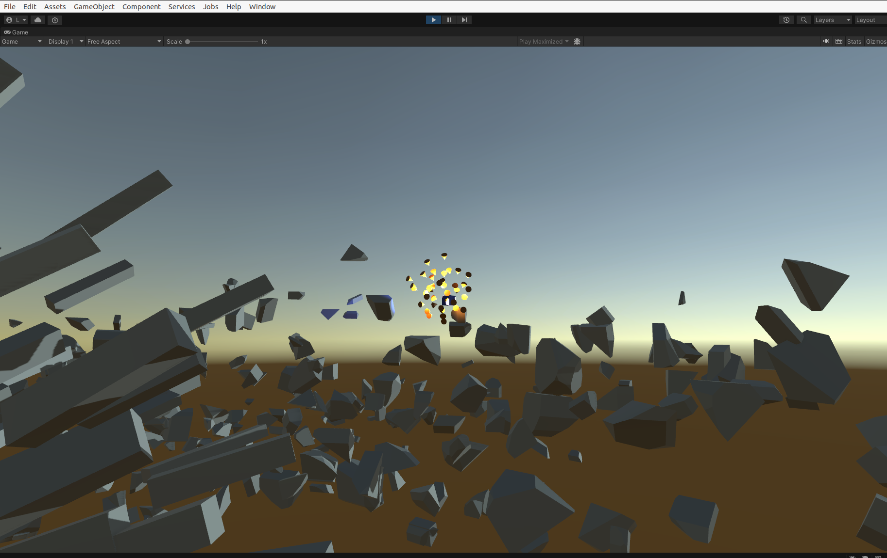

# Unity Boids

WIP!

Unity 2022.3.13f1 Vulkan

Boids Simulation In Unity

Inspired by:
* https://www.youtube.com/watch?v=bqtqltqcQhw
* http://www.cs.toronto.edu/~dt/siggraph97-course/cwr87/

### Features:

* Boid prefab: 3D object (mesh and material) with position, orientation and velocity
* Multiple boid spawning points
* Boid manager for moving boids to target
* Interactive target
* Avoiding collisions with other boids
* Avoiding collisions with other objects
* Keeping distance between boids
* Not going too far from boid center
* Environment
* Camera controller

### Gallery

